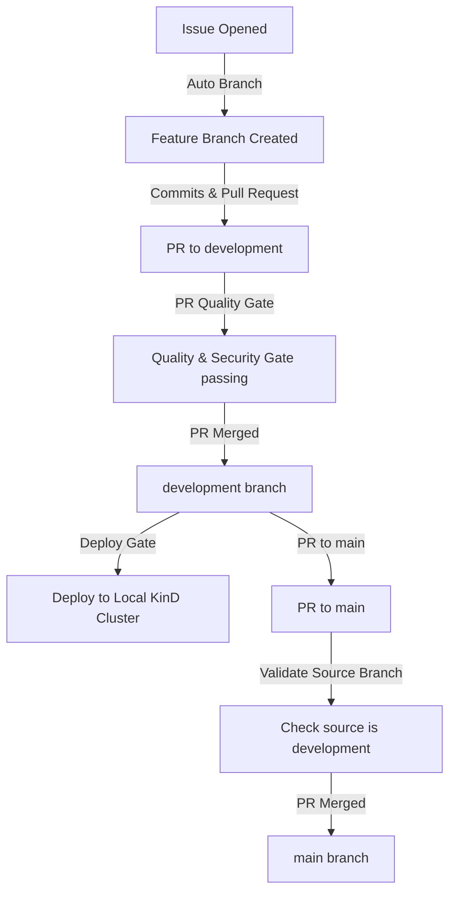

# CI/CD Pipeline & Workflows Guide

This document describes the complete CI/CD pipeline and automated workflows configured in the TodoSphere repository. The workflows have been sanitized and hardened for a public open-source environment.

---

## 📐 Pipeline Overview

Our CI/CD architecture operates across a protected branching strategy:
- `main` (protected): Contains production-ready code. Direct push is disabled.
- `development`: Active integration branch.
- `feature/*`: Development branches created dynamically for issues.



---

## 🛠️ Detailed Workflow Documentation

### 1. Validate PR Source Branch (`protect-main.yml`)
- **Purpose**: Enforces that pull requests targeting `main` can only originate from the `development` branch.
- **Trigger**: Pull requests targeting `main`.
- **Permissions**:
  ```yaml
  permissions:
    contents: read
  ```
- **Key Check**:
  - Validates that `github.head_ref` is exactly `development`. If not, it fails the run and blocks the PR.

---

### 2. Auto Branch on Issue (`branch-create.yml`)
- **Purpose**: Automatically generates a new feature branch when a GitHub issue is opened.
- **Trigger**: Issues `opened` event.
- **Concurrency**: Grouped by issue number (`issue-${{ github.event.issue.number }}`) to avoid race conditions.
- **Permissions**:
  ```yaml
  permissions:
    contents: write
    issues: write
  ```
- **Key Steps**:
  1. Generates branch name format: `feature/issue-<issue_number>`.
  2. Queries the GitHub API to check if the branch exists.
  3. If it doesn't exist, queries the SHA of the `development` branch and creates the feature branch from it.
  4. Comments on the issue with instructions to get started.

---

### 3. PR Quality Gate (`pr-check.yml`)
- **Purpose**: The main pull request gate. Checks code quality, format, types, security vulnerabilities, and builds containers before code can be merged into `development`.
- **Trigger**: Pull requests targeting `development` with changes in backend, frontend, infrastructure files, or scripts.
- **Concurrency**: Grouped by PR number (`pr-${{ github.event.pull_request.number }}`) with `cancel-in-progress: true`.
- **Permissions**: Hardened to job-level least privilege:
  - `branch-check`, `backend-checks`, `frontend-checks`, `security-scan`, `notify` jobs: `contents: read`.
  - `build-scan-push` job: `contents: read`, `packages: write` (to push images), `pull-requests: write` (to comment on the PR).
- **Key Jobs**:
  - **Branch Up-to-Date Check**: Ensures the PR branch is fully updated with the latest `development` commits.
  - **Backend Checks**: Installs backend Python dependencies using `uv` and runs:
    - Ruff (linter & formatter checks)
    - MyPy (strict type check)
    - Bandit (security scan)
    - Pip-audit (dependency vulnerability audit)
  - **Frontend Checks**: Installs Node.js dependencies and runs:
    - ESLint & Prettier formatter check
    - TypeScript compilation (`tsc`)
    - NPM audit (dependency vulnerability check)
  - **Security Scan**:
    - TruffleHog (secret detection scanning)
    - Trivy (filesystem scanning for CVEs)
    - Checks for trailing whitespace, merge conflict markers, and large files (>1MB).
  - **Build, Scan & Push**:
    - Builds backend & frontend Docker containers.
    - Scans containers for CVEs using Trivy.
    - Pushes images to GHCR tagged with `pr-<PR_number>` and comments on the PR with the resulting digests.
  - **Notify Status**: A consolidated reporting job that runs `if: always()` after all quality checks have executed, providing a single summary of job results and an integration point for Slack or Discord webhooks.

---

### 4. Heavy Testing (`heavy-test.yml`)
- **Purpose**: Runs heavy unit, integration, end-to-end, performance, and accessibility tests in an active environment.
- **Trigger**: Triggered when a PR review is `submitted` and approved, or when the `run-heavy-tests` label is added to a PR.
- **Runner**: Runs on a self-hosted Windows runner `[self-hosted, windows, local, kind]`.
- **Permissions**: `contents: read`, `packages: read`, `pull-requests: read`.
- **Key Steps**:
  1. Pulls the built PR images from GHCR.
  2. Spins up a temporary isolated test stack using `docker-compose.test.yml`.
  3. Runs database migrations on the test stack.
  4. Runs **Pytest** for Backend Unit & Integration tests, producing HTML coverage and JUnit reports.
  5. Runs **Vitest** for Frontend Unit tests, producing HTML coverage and JUnit reports.
  6. Runs **Playwright** for E2E tests.
  7. Runs **Lighthouse Audit** dynamically resolving Playwright's Chromium executable on the Windows host.
  8. Runs **Locust Smoke Load Test** to verify performance metrics under load.
  9. Tears down the temporary Docker Compose stack.
  10. Consolidates notification reports in a final status step.

---

### 5. Deploy to Development (`deploy-development.yml`)
- **Purpose**: Automatically deploys the application to the local KinD (Kubernetes in Docker) cluster when changes are merged into `development`.
- **Trigger**: Direct push to the `development` branch.
- **Runner**: Runs on a self-hosted Windows runner `[self-hosted, windows, local, kind]`.
- **Permissions**: `contents: read`, `packages: write` (to delete outdated tags), `pull-requests: read`.
- **Key Steps**:
  1. Detects whether the trigger is a direct commit or a merged pull request.
  2. Pulls built images from GHCR and tags them locally.
  3. Loads images into the local KinD cluster.
  4. Applies base Kubernetes manifests (namespace, secrets with safe dev placeholders, configmap, postgres, redis, localstack, backend, frontend, ingress).
  5. **Blue-Green Deployment**:
     - Detects the current active slot (blue/green).
     - Updates the standby slot with the new image digests.
     - Runs database migrations via `alembic` in the standby pod.
     - Switches Kubernetes service selectors (traffic routing) to the standby slot.
     - Runs ingress post-deploy health checks.
     - If the health check fails, service selectors are automatically reverted back to the active slot (zero-downtime rollback).
  6. Pushes the stable images to GHCR tagged as `latest`.
  7. Deletes temporary PR tags from GHCR.
  8. Cleans up docker containers/images from the runner disk.
  9. Consolidates notification results in a single final status report.
