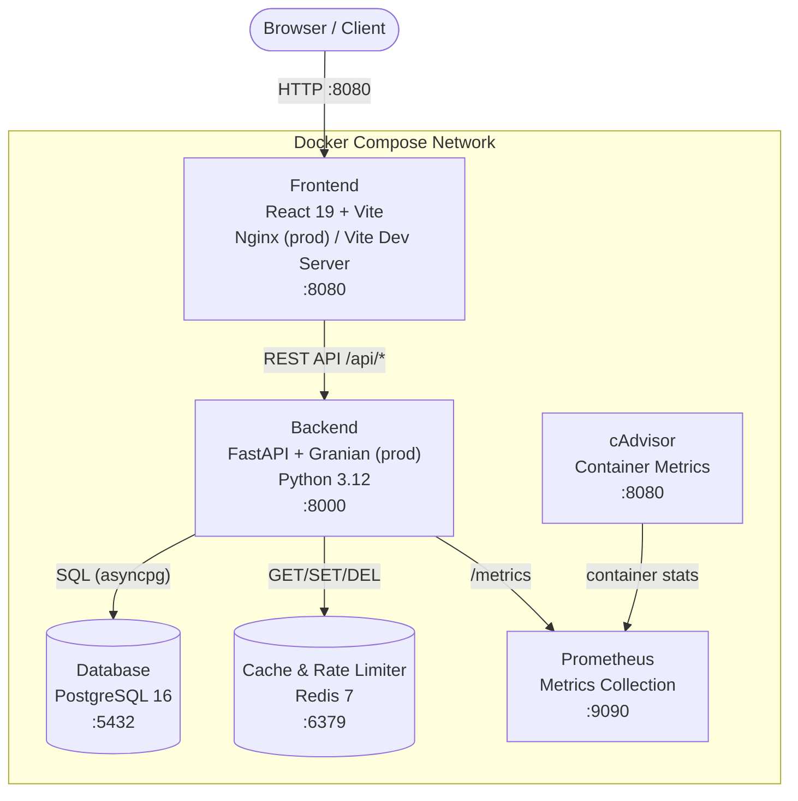

# TodoSphere

A full-stack task management application built with FastAPI, React 19, TypeScript, PostgreSQL, and Redis. Orchestrated with Docker Compose and verified with an automated quality pipeline.


---

## 📂 Sub-Project Portals

For detailed documentation, development setup, and API details on each specific layer:

- 💻 **[React Frontend Portal](frontend/README.md)**: React 19, Vite, TypeScript, Vanilla CSS, React Doctor (96/100), and Lighthouse audits.
- ⚙️ **[FastAPI Backend Service](backend/README.md)**: FastAPI, Pydantic, SQLAlchemy, Alembic, uv, and security middleware.

---

## 🏗️ Architecture Diagram

The application is composed of six Docker services communicating over a shared bridge network.



---

## 🛠️ Technical Stack

| Layer | Technology |
|---|---|
| **Frontend** | React 19, TypeScript, Vite 8, Vanilla CSS (Light/Dark mode) |
| **Backend** | FastAPI, Python 3.12, Granian (ASGI, prod) |
| **Database** | PostgreSQL 16, SQLAlchemy 2.x, Alembic migrations |
| **Cache / Rate Limiting** | Redis 7, SlowAPI |
| **Auth** | JWT (RS256-style rotation), HttpOnly cookies, Argon2id password hashing |
| **Package Managers** | `uv` (Python), `npm` (Node) |
| **Quality Tools** | Ruff, Prettier, ESLint, MyPy (strict), Bandit, Pip-Audit, NPM Audit |
| **Testing** | Pytest (unit/integration), Vitest (component), Playwright (E2E), Locust (load) |
| **Security Scanning** | Trivy (Docker image CVE scanning) |
| **Observability** | Prometheus metrics, structured JSON logs, `X-Correlation-ID` request tracing |
| **Orchestration** | Docker Compose, named volumes, multi-stage builds, non-root containers |

---

## 📊 Verified Quality Metrics

The following numbers are pulled from the latest generated reports in the `reports/` directory:

| Metric | Result | Report |
|---|---|---|
| Backend test coverage | **88%** (1107/1251 statements) | `reports/backend-coverage/index.html` |
| Frontend component tests | Vitest suite | `reports/frontend-report.xml` |
| React Doctor score | **96 / 100** | `reports/react-doctor-report.txt` |
| Lighthouse audit | HTML report | `reports/lighthouse-report.html` |
| Playwright E2E | HTML report | `reports/playwright-report/index.html` |
| Trivy Docker scan | 0 HIGH / 0 CRITICAL | run `make trivy-scan` |

> Note: The coverage threshold in `pyproject.toml` is set at `fail_under = 90`. The current 88% result means the `make test` target will exit with a non-zero code until coverage is brought back above that threshold.

---

## 🌟 Architectural & DevOps Highlights

1. **Multi-Stage Docker Builds**: Separate development (`Dockerfile.dev`) and production (`Dockerfile`) images for both backend and frontend. Dependencies are baked into cached layers rather than mounted from the host, keeping development environments isolated and reproducible.
2. **Refresh Token Rotation**: Authentication sessions use HttpOnly cookies with token rotation. If an invalid or reused refresh token is detected, all active sessions for that user are revoked immediately.
3. **Database-Layer Constraints**: Check constraints (`expected_end_time >= start_time`, `actual_end_time >= start_time`) are enforced directly at the PostgreSQL level, not only in application code.
4. **Task State Machine**: Status transitions are restricted (e.g. `Done` is terminal). Durations are calculated automatically on completion.
5. **Background Scheduler**: An async task transitions overdue tasks to `Missed` status without blocking request handling.
6. **Storage Provider Abstraction**: An abstract `StorageProvider` interface supports local and S3 backends. File uploads are restricted to 5 MB and `.jpg`, `.jpeg`, `.png`, `.webp` formats.
7. **Structured JSON Logging**: Request-scoped middleware injects a unique `X-Correlation-ID` into every log entry using context variables, enabling distributed trace correlation.
8. **Security Headers**: All responses carry `X-Frame-Options`, `X-Content-Type-Options`, and `Referrer-Policy` headers via middleware.
9. **Trivy Image Scanning**: Both production Docker images are scanned for CVEs using `make trivy-scan`. All HIGH and CRITICAL findings are patched via `apt-get upgrade` / `apk upgrade` in each Dockerfile.

---

## 🚀 Quick Start Guide

### Prerequisites

- **Docker & Docker Compose**: Required for running the application services.
- **make**: Used for executing automated tasks via the Makefile.

### 1. Spin Up Application Stack

Launch the database, cache, API backend, and frontend interface:

```bash
make up-build
```

Access the application at `http://localhost:8080`. The FastAPI interactive docs are accessible at `http://localhost:8000/docs`.

### 2. Seed Mock Database Data

Create a test account (`demo_user` / `Password123!`) seeded with 10+ historical tasks:

```bash
make seed
```

---

## 💻 Developer Command Reference

All common developer tasks are orchestrated via the root `Makefile`.

### Docker Operations

| Command | Description |
|---|---|
| `make build` | Rebuild all dev images fresh (no cache) |
| `make up` | Start the full dev stack in the background |
| `make up-build` | Build and start the full dev stack |
| `make down` | Stop and remove containers (keep volumes) |
| `make down-clean` | Stop containers and remove volumes (**DESTROYS DATA**) |
| `make restart` | Restart all containers |
| `make logs` | Follow logs from all containers |
| `make logs-backend` | Follow backend logs only |
| `make logs-frontend` | Follow frontend logs only |
| `make shell-backend` | Open a shell in the running backend container |
| `make shell-frontend` | Open a shell in the running frontend container |

### Database Operations

| Command | Description |
|---|---|
| `make migrate` | Run `alembic upgrade head` |
| `make migration name="..."` | Create a new Alembic revision |
| `make rollback` | Roll back the last migration |
| `make db-reset` | Roll back all and re-migrate (**DESTROYS DATA**) |
| `make db-shell` | Open a psql shell inside the PostgreSQL container |
| `make redis-shell` | Open a redis-cli shell |
| `make seed` | Seed the dev database with demo data |

### Quality Checks & Formatting

- **`make check`**: Runs all quality checks for backend and frontend sequentially. Prints subtask names and returns exit code `1` if any check fails.
  - *Checks:* Ruff, Ruff Formatter, MyPy, Bandit, Pip-Audit, Prettier, ESLint, TypeScript compilation, NPM Audit, React Doctor, Lighthouse.
- **`make check-fix`**: Runs auto-fixers across backend and frontend (Ruff, Prettier, ESLint `--fix`).

### Automated Testing

- **`make test`**: Resets `reports/`, runs pytest (unit/integration), Vitest (component), and Playwright (E2E). Saves coverage and JUnit XML reports to `reports/`.
  - The database password is auto-detected: if `todosphere-prod-db` is running it uses `changeme_in_prod`, otherwise it defaults to the dev password.
- **`make test-perf`**: Locust performance test (default: 50 users, spawn rate 10, 1 minute).
- **`make test-stress`**: Locust stress test (500 users, spawn rate 50, 5 minutes).

### Security Scanning

- **`make trivy-scan`**: Scans both built Docker images (`to-do-application-backend` and `to-do-application-frontend`) using Trivy. Fails if any **fixable** `HIGH` or `CRITICAL` CVEs are found. Uses a persistent Docker volume (`todosphere-trivy-cache`) to cache the vulnerability database between runs.
  - The scan uses `--ignore-unfixed` to skip CVEs that have no available fix in the upstream package repository.
  - CVEs in essential Debian packages (`perl-base`, `ncurses-base`, `ncurses-bin`, `libncursesw6`) that cannot be removed without breaking the OS are listed in [`.trivyignore`](.trivyignore) with documented rationale. Re-evaluate when Debian releases patches.

---

## 📊 Compiled Quality Reports Directory (`reports/`)

All verification tasks write output to the root-level `reports/` folder:

| Report | Path |
|---|---|
| React Doctor Diagnostics | `reports/react-doctor-report.txt` (Score: 96/100) |
| Lighthouse Performance HTML | `reports/lighthouse-report.html` |
| Backend Test Coverage (HTML) | `reports/backend-coverage/index.html` |
| Backend JUnit XML | `reports/backend-report.xml` |
| Frontend Test Coverage (HTML) | `reports/frontend-coverage/index.html` |
| Frontend JUnit XML | `reports/frontend-report.xml` |
| Playwright E2E HTML Report | `reports/playwright-report/index.html` |
