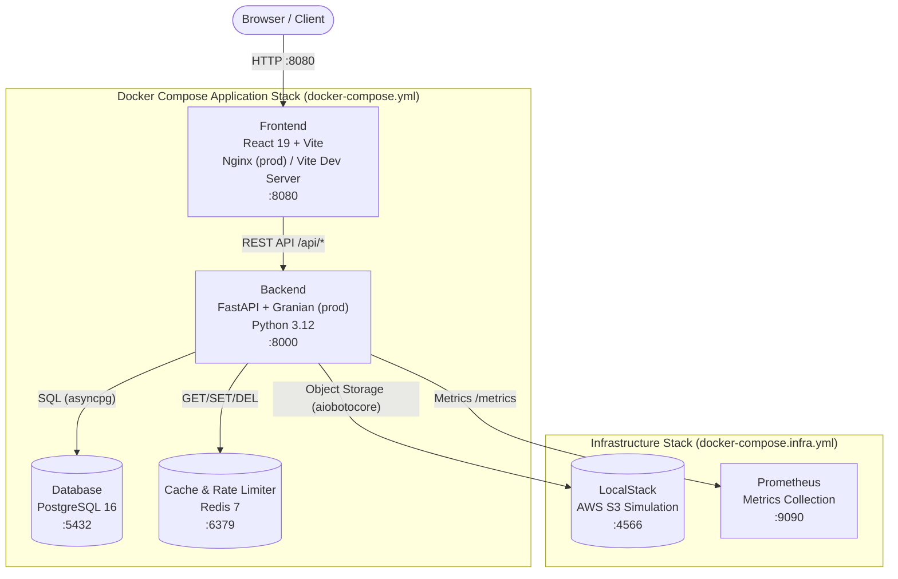

# TodoSphere

A full-stack task management application built with FastAPI, React 19, TypeScript, PostgreSQL, and Redis. Orchestrated with Docker Compose and verified with an automated quality pipeline.


---

## 📂 Sub-Project Portals

For detailed documentation, development setup, and API details on each specific layer:

- 💻 **[React Frontend Portal](frontend/README.md)**: React 19, Vite, TypeScript, Vanilla CSS, React Doctor (96/100), and Lighthouse audits.
- ⚙️ **[FastAPI Backend Service](backend/README.md)**: FastAPI, Pydantic, SQLAlchemy, Alembic, uv, and security middleware.

---

## 🏗️ Architecture Diagram

The application is composed of core services orchestrated by Docker Compose, auxiliary infrastructure services for simulation and observability, and production deployment manifests for Kubernetes.



---

## 🛠️ Technical Stack

| Layer | Technology |
|---|---|
| **Frontend** | React 19, TypeScript, Vite 8, Vanilla CSS (Light/Dark mode) |
| **Backend** | FastAPI, Python 3.12, Granian (ASGI, prod) |
| **Database** | PostgreSQL 16, SQLAlchemy 2.x, Alembic migrations |
| **Cache / Rate Limiting** | Redis 7, SlowAPI |
| **Cloud Storage** | AWS S3 / LocalStack (simulated S3 using aiobotocore) |
| **Auth** | JWT (RS256-style rotation), HttpOnly cookies, Argon2id password hashing |
| **Package Managers** | `uv` (Python), `npm` (Node) |
| **Quality Tools** | Ruff, Prettier, ESLint, MyPy (strict), Bandit, Pip-Audit, NPM Audit |
| **Testing** | Pytest (unit/integration), Vitest (component), Playwright (E2E), Locust (load) |
| **Security Scanning** | Trivy (Docker image CVE scanning), TruffleHog (Secrets scanning) |
| **Observability** | Prometheus metrics, structured JSON logs, `X-Correlation-ID` request tracing |
| **Orchestration / K8s** | Docker Compose, KinD (Kubernetes in Docker), Ingress Nginx, HPA |

---

## 📊 Verified Quality Metrics

The following numbers are pulled from the latest generated reports in the `reports/` directory:

| Metric | Result | Report |
|---|---|---|
| Backend test coverage | **88%** (1107/1251 statements) | `reports/backend-coverage/index.html` |
| Frontend component tests | Vitest suite | `reports/frontend-report.xml` |
| React Doctor score | **96 / 100** | `reports/react-doctor-report.txt` |
| Lighthouse audit | HTML report | `reports/lighthouse-report.html` |
| Playwright E2E | HTML report | `reports/playwright-report/index.html` |
| Trivy Docker scan | 0 HIGH / 0 CRITICAL | run `make trivy-scan` |

> Note: The coverage threshold in `pyproject.toml` is set at `fail_under = 90`. The current 88% result means the `make test` target will exit with a non-zero code until coverage is brought back above that threshold.

---

## 🌟 Architectural & DevOps Highlights

1. **Multi-Stage Docker Builds**: Separate development (`Dockerfile.dev`) and production (`Dockerfile`) images for both backend and frontend. Dependencies are baked into cached layers rather than mounted from the host, keeping development environments isolated and reproducible.
2. **Refresh Token Rotation**: Authentication sessions use HttpOnly cookies with token rotation. If an invalid or reused refresh token is detected, all active sessions for that user are revoked immediately.
3. **Database-Layer Constraints**: Check constraints (`expected_end_time >= start_time`, `actual_end_time >= start_time`) are enforced directly at the PostgreSQL level, not only in application code.
4. **Task State Machine**: Status transitions are restricted (e.g. `Done` is terminal). Durations are calculated automatically on completion.
5. **Background Scheduler**: An async task transitions overdue tasks to `Missed` status without blocking request handling.
6. **Asynchronous S3 Storage Provider**: Implements a production-ready async storage provider utilizing `aiobotocore` that integrates seamlessly with AWS S3 or LocalStack. File uploads are validated (5 MB size limit, formats: `.jpg`, `.jpeg`, `.png`, `.webp`).
7. **Structured JSON Logging**: Request-scoped middleware injects a unique `X-Correlation-ID` into every log entry using context variables, enabling distributed trace correlation.
8. **Security Headers**: All responses carry `X-Frame-Options`, `X-Content-Type-Options`, and `Referrer-Policy` headers via middleware.
9. **Trivy Image Scanning**: Both production Docker images are scanned for CVEs using `make trivy-scan`. All HIGH and CRITICAL findings are patched via `apt-get upgrade` / `apk upgrade` in each Dockerfile.
10. **Dual-Gate CI/CD with Auto-Revert**: An automated PR Quality Gate (GitHub-hosted runner) and a Deploy Gate (self-hosted Windows runner) ensure code quality. The Deploy Gate starts a temporary test stack, runs Playwright/Lighthouse/Locust, and rolls back Kubernetes deployments or auto-reverts the git merge on failure.
11. **Production-grade Local Kubernetes (KinD)**: Complete deployment orchestration via Kubernetes manifests using Ingress Nginx, horizontal pod autoscaling (HPA), persistent volumes, secret configuration, and statefulsets.

---

## 🚀 Setup Prerequisites & Configuration

Before running the application stack or setting up the production pipeline, ensure the following prerequisites are installed and configured:

### 1. Local Tooling & Utilities
- **Docker & Docker Compose**: For building, running, and testing containerized services.
- **make**: CLI utility for running automation recipes via the root `Makefile`.
- **kubectl**: Kubernetes command-line tool for cluster communication and manifest orchestration.
- **Helm**: Kubernetes package manager used to deploy ingress controllers (e.g., `ingress-nginx`).
- **KinD (Kubernetes in Docker)**: Lightweight tool for running local Kubernetes clusters.
- **cloudflared**: Cloudflare Tunnel client to securely expose local ingress ports (`localhost:8080`) to the public internet for webhook or CI callbacks.
- **Node.js (v18+) & Python (v3.12+)**: Node is required for running frontend test suites (Vitest, Playwright, Lighthouse audits); Python and `uv` are needed for running backend code checks (Ruff, MyPy, Bandit, pip-audit).

### 2. GitHub Actions Self-Hosted Runner
Workflow 2 (Deploy Gate) executes on a local self-hosted Windows runner. The host machine running the self-hosted runner must satisfy the following software dependencies:
- **Runner Configuration**: Set up the runner in your repository settings under **Settings > Actions > Runners** using a new self-hosted Windows runner.
- **Tags**: Configure the runner with the following labels: `self-hosted`, `windows`, `local`, `kind`.
- **Active Agent**: The runner agent must be active (`.\run.cmd` executed in a dedicated terminal).
- **Google Chrome**: Installed on the host system (required for headless Lighthouse audits).
- **Node.js**: Installed on the host system (required to run `npx lighthouse` and `npx playwright`).
- **Python 3.12 & uv**: Installed on the host system (required to run backend test scripts, locust load tests, and post-test assessment scripts).
- **Docker Desktop / Docker Engine**: Active and running on the host system to run the test stack (`docker-compose.test.yml`) and deploy to KinD.
- **kubectl & Helm**: Installed and accessible in the system PATH so the runner can manage the KinD Kubernetes cluster.

### 3. GitHub Secrets Configuration
The CI/CD workflows require the following repository secrets configured under **Settings > Secrets and variables > Actions > Repository secrets**:

| Secret Name | Purpose | Example Value |
|---|---|---|
| `KUBECONFIG_PATH` | Path to the local Kubernetes config file on the runner | `C:/Users/<user>/.kube/config` |
| `DB_PASSWORD` | Production PostgreSQL password | `prod_secure_password_123` |
| `JWT_ACCESS_SECRET` | Secret key used for signing short-lived access tokens | `prod_access_secret_key_rotation_token` |
| `JWT_REFRESH_SECRET` | Secret key used for signing refresh tokens | `prod_refresh_secret_key_rotation_token` |
| `CORS_ORIGINS` | JSON array of permitted origins | `["http://localhost:8080"]` |
| `CLOUDFLARE_TUNNEL_URL` | Public tunnel URL generated by cloudflared | `https://todosphere.trycloudflare.com` |
| `NOTIFY_EMAIL_USER` | Gmail SMTP sender address for status reports | `ci-notifications@gmail.com` |
| `NOTIFY_EMAIL_PASS` | Gmail SMTP App Password (not standard account password) | `abcd efgh ijkl mnop` |
| `NOTIFY_EMAIL_TO` | Target recipient address for CI/CD alerts | `dev-team@company.com` |

---

## 🚀 Quick Start Guide

### 1. Spin Up Application Stack

Launch the database, cache, API backend, and frontend interface:

```bash
make up-build
```

Access the application at `http://localhost:8080`. The FastAPI interactive docs are accessible at `http://localhost:8000/docs`.

### 2. Seed Mock Database Data

Create a test account (`demo_user` / `Password123!`) seeded with 10+ historical tasks:

```bash
make seed
```

---

## 💻 Developer Command Reference

All common developer tasks are orchestrated via the root `Makefile`.

### Docker Operations (Core Stack)

| Command | Description |
|---|---|
| `make build` | Rebuild all dev images fresh (no cache) |
| `make up` | Start the full dev stack in the background |
| `make up-build` | Build and start the full dev stack |
| `make down` | Stop and remove containers (keep volumes) |
| `make down-clean` | Stop containers and remove volumes (**DESTROYS DATA**) |
| `make restart` | Restart all containers |
| `make logs` | Follow logs from all containers |
| `make logs-backend` | Follow backend logs only |
| `make logs-frontend` | Follow frontend logs only |
| `make shell-backend` | Open a shell in the running backend container |
| `make shell-frontend` | Open a shell in the running frontend container |

### Infrastructure Operations (LocalStack, Prometheus)

| Command | Description |
|---|---|
| `make infra-up` | Start infrastructure services (LocalStack, Prometheus) in the background |
| `make infra-down` | Stop and remove infrastructure containers |
| `make infra-logs` | Follow logs from infrastructure services |
| `make infra-status` | Show status of infrastructure containers |

### Kubernetes & KinD Operations

| Command | Description |
|---|---|
| `make kind-create` | Create the local KinD cluster (`todosphere`) using `k8s/kind-config.yml` |
| `make kind-delete` | Delete the KinD cluster |
| `make kind-status` | Check cluster information and active pod status in `todosphere` namespace |
| `make k8s-apply` | Apply Kubernetes manifests in dependency order to the cluster (namespace, configmap, postgres, redis, localstack, backend, frontend, ingress) |
| `make k8s-delete` | Delete the `todosphere` namespace and all its resources from the cluster |

### Database Operations

| Command | Description |
|---|---|
| `make migrate` | Run `alembic upgrade head` |
| `make migration name="..."` | Create a new Alembic revision |
| `make rollback` | Roll back the last migration |
| `make db-reset` | Roll back all and re-migrate (**DESTROYS DATA**) |
| `make db-shell` | Open a psql shell inside the PostgreSQL container |
| `make redis-shell` | Open a redis-cli shell |
| `make seed` | Seed the dev database with demo data |

### Quality Checks & Formatting

- **`make check`**: Runs all quality checks for backend and frontend sequentially. Prints subtask names and returns exit code `1` if any check fails.
  - *Checks:* Ruff, Ruff Formatter, MyPy, Bandit, Pip-Audit, Prettier, ESLint, TypeScript compilation, NPM Audit, React Doctor, Lighthouse.
- **`make check-fix`**: Runs auto-fixers across backend and frontend (Ruff, Prettier, ESLint `--fix`).

### Automated Testing

- **`make test`**: Resets `reports/`, runs pytest (unit/integration), Vitest (component), and Playwright (E2E). Saves coverage and JUnit XML reports to `reports/`.
  - The database password is auto-detected: if `todosphere-prod-db` is running it uses `changeme_in_prod`, otherwise it defaults to the dev password.
- **`make test-perf`**: Locust performance test (default: 50 users, spawn rate 10, 1 minute).
- **`make test-stress`**: Locust stress test (500 users, spawn rate 50, 5 minutes).

### Security Scanning

- **`make trivy-scan`**: Scans both built Docker images (`to-do-application-backend` and `to-do-application-frontend`) using Trivy. Fails if any **fixable** `HIGH` or `CRITICAL` CVEs are found. Uses a persistent Docker volume (`todosphere-trivy-cache`) to cache the vulnerability database between runs.
  - The scan uses `--ignore-unfixed` to skip CVEs that have no available fix in the upstream package repository.
  - CVEs in essential Debian packages (`perl-base`, `ncurses-base`, `ncurses-bin`, `libncursesw6`) that cannot be removed without breaking the OS are listed in [`.trivyignore`](.trivyignore) with documented rationale. Re-evaluate when Debian releases patches.

---

## 📊 Compiled Quality Reports Directory (`reports/`)

All verification tasks write output to the root-level `reports/` folder:

| Report | Path |
|---|---|
| React Doctor Diagnostics | `reports/react-doctor-report.txt` (Score: 96/100) |
| Lighthouse Performance HTML | `reports/lighthouse-report.html` |
| Backend Test Coverage (HTML) | `reports/backend-coverage/index.html` |
| Backend JUnit XML | `reports/backend-report.xml` |
| Frontend Test Coverage (HTML) | `reports/frontend-coverage/index.html` |
| Frontend JUnit XML | `reports/frontend-report.xml` |
| Playwright E2E HTML Report | `reports/playwright-report/index.html` |

---

## 🛠️ Developer Setup and Workflow

### Local Development (Daily Work)
1. **Start application services**:
   ```bash
   docker compose up -d
   ```
2. **Start infrastructure services** (when S3 or Prometheus simulation is needed):
   ```bash
   make infra-up
   ```
3. **Configure Local Environment variables**:
   To enable S3 upload simulation in local development, configure `backend/.env` with:
   ```env
   STORAGE_PROVIDER=s3
   S3_BUCKET_NAME=todosphere-attachments
   S3_ACCESS_KEY=mock_access_key
   S3_SECRET_KEY=mock_secret_key
   S3_ENDPOINT_URL=http://localhost:4566
   ```
4. **Access URLs**:
   - Backend API: `http://localhost:8000`
   - Frontend Web App: `http://localhost:8080`

### KinD Cluster (Local Production Environment)
1. **Runner Prerequisites**:
   - Ensure the self-hosted runner is active on your machine:
     ```bash
     .\run.cmd
     ```
   - Ensure the Cloudflare tunnel is running in a separate terminal:
     ```bash
     cloudflared tunnel --url http://localhost:8080
     ```
2. **Create cluster and set up Ingress Controller**:
   Create the cluster using the Makefile command:
   ```bash
   make kind-create
   ```
   Install the Nginx Ingress Controller using Helm:
   ```bash
   helm install ingress-nginx ingress-nginx/ingress-nginx \
     --namespace ingress-nginx \
     --create-namespace \
     --values k8s/ingress/ingress-nginx-values.yml
   ```
3. **Cluster Lifecycle & Deployment**:
   - Check cluster info and pod health:
     ```bash
     make kind-status
     ```
   - Manually apply all manifests (in correct order, excluding `secrets.yml` which is populated dynamically in CI):
     ```bash
     make k8s-apply
     ```

### CI/CD Pipeline
- **PR Quality Gate (Workflow 1)**: Triggered automatically on GitHub-hosted runners when a Pull Request is opened or updated targeting `main`. Skips checks automatically on revert branches/titles (`revert:`).
  - *Steps:* Runs linting (Ruff/ESLint), formatting check (Ruff/Prettier), strict type checking (MyPy/TypeScript compile), security analysis (Bandit/TruffleHog/Trivy FS scan), builds and scans backend and frontend images, pushes built images to GHCR tagged with the PR SHA.
- **Deploy Gate (Workflow 2)**: Triggers automatically on the local self-hosted runner when a PR is merged into `main` (push to main).
  - *Steps:* Pulls the tagged PR images, launches a temporary isolated test stack using `docker-compose.test.yml`, runs migrations, runs live validation tests (Playwright E2E suite, Lighthouse performance audits, Locust smoke tests). If any test fails, it tears down the stack, deletes the deployment, opens an automated revert PR, and alerts the team. On success, it applies secrets and configurations to the KinD cluster, updates deployment images, verifies rollouts, and tags the stable images as `latest` in GHCR.

### Required Always-On Terminals
- **Terminal 1**: `.\run.cmd` (within your GitHub runner folder) — must remain running to execute Workflow 2.
- **Terminal 2**: `cloudflared tunnel --url http://localhost:8080` — must remain running to expose the Ingress public port to the internet.
